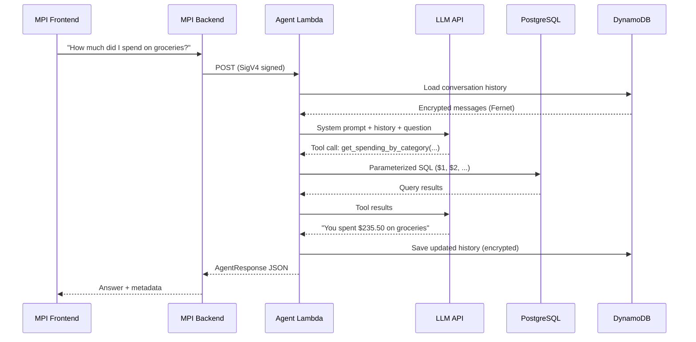
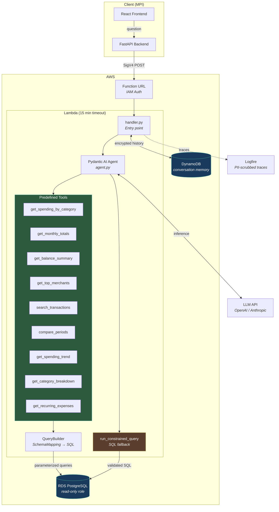
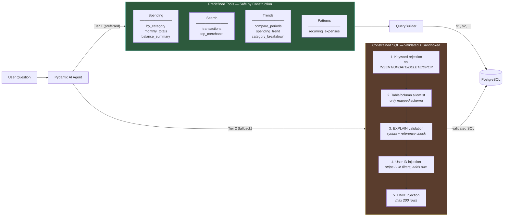
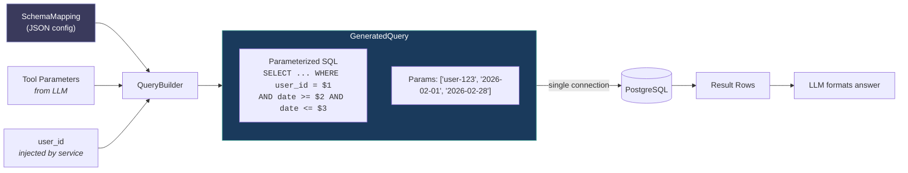
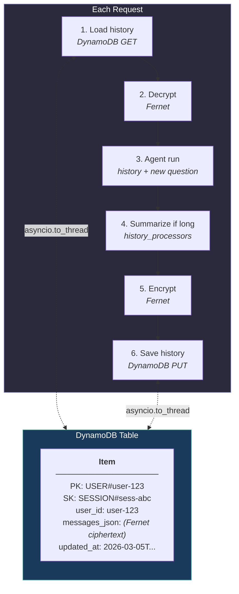
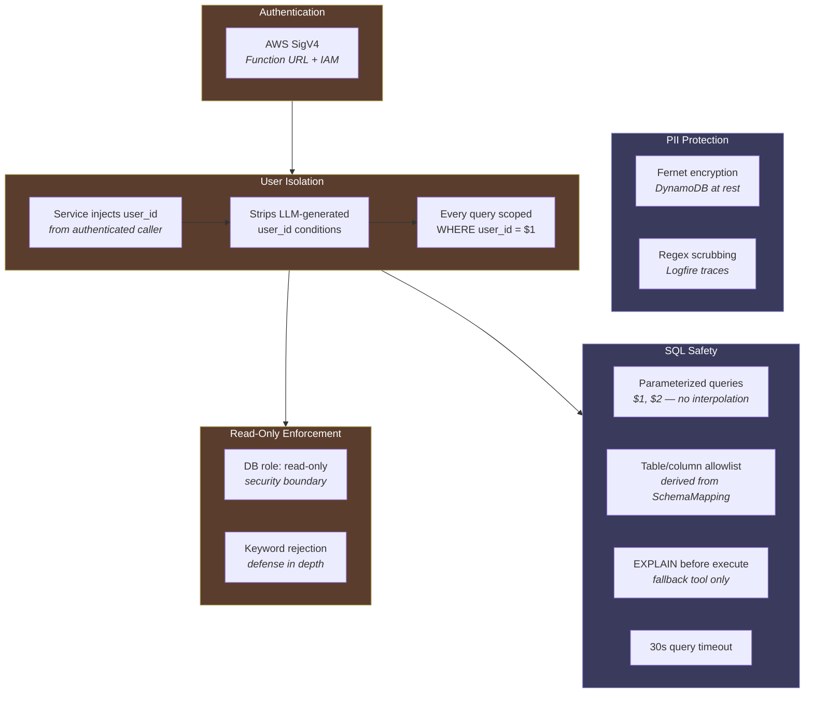

# finance-query-agent

AI-powered financial query agent. Answers natural language questions about spending, income, and transactions. Deployed as an AWS Lambda behind a Function URL.

Uses a **tools-as-wrappers** architecture: the LLM picks a tool and fills parameters, the service generates and executes parameterized SQL. No raw SQL from the LLM for the common case — a constrained SQL fallback covers the long tail.

## Request Lifecycle



## Architecture Overview



## Tool Architecture

The agent has two tiers of query tools. The LLM always prefers predefined tools — the fallback is a last resort.



## Query Generation Pipeline

All SQL is derived from a declarative `SchemaMapping` — no hand-written queries.



For multi-source schemas (bank accounts + credit cards), the builder generates `UNION ALL` with independent JOINs per table and re-aggregates across both sources.

## Conversation Memory



## Security Model



## Schema Mapping (Client Integration)

The only thing a client provides. A declarative config that maps their DB schema to the agent's tools.

```mermaid
graph LR
    subgraph SchemaMapping["SchemaMapping (JSON)"]
        direction TB
        TX["transactions<br/>─────────────────<br/>table: account_movements<br/>columns: date, amount, ...<br/>joins: accounts, tags<br/>amount_convention: debit/credit"]
        CAT["categories<br/>─────────────────<br/>table: tags<br/>columns: id, name<br/>user_scoped: false"]
        ACCT["accounts<br/>─────────────────<br/>table: accounts<br/>columns: id, name, user_id"]
        SEC["secondary_transactions<br/><i>(optional)</i><br/>─────────────────<br/>table: credit_card_movements<br/>independent joins + convention"]
    end

    SchemaMapping --> DERIVES

    subgraph DERIVES["Service Derives"]
        direction TB
        D1["All predefined tool queries"]
        D2["Fallback SQL allowlist"]
        D3["User isolation WHERE clauses"]
        D4["UNION ALL for multi-source"]
        D5["Schema validation on startup"]
    end

    style SchemaMapping fill:#3a3a5c,stroke:#88c,color:#fff
    style DERIVES fill:#2d5a3d,stroke:#4a9,color:#fff
```



## Invocation

The Function URL requires AWS SigV4 authentication. Send a POST request:

```json
{
  "user_id": "user-123",
  "session_id": "sess-abc",
  "question": "How much did I spend on groceries last month?"
}
```

Response:

```json
{
  "answer": "You spent $235.50 on groceries last month across 3 transactions.",
  "tool_calls": [...],
  "fallback_used": false,
  "unresolved": false,
  "original_question": "How much did I spend on groceries last month?",
  "token_usage": { "input_tokens": 1200, "output_tokens": 85 }
}
```

## Project Structure

```
src/finance_query_agent/
├── handler.py              Lambda entry point (Function URL)
├── agent.py                Pydantic AI agent + system prompt
├── config.py               Settings from env vars
├── query_builder.py        SchemaMapping → parameterized SQL
├── connection.py           asyncpg single connection (Lambda-aware)
├── memory.py               DynamoDB conversation history
├── encryption.py           Fernet field encryption
├── redaction.py            Regex PII scrubbing
├── history.py              Conversation summarization
├── observability.py        Logfire + scrubbing callback
├── exceptions.py           Exception hierarchy
├── tools/
│   ├── spending.py         by_category, monthly_totals, balance_summary
│   ├── transactions.py     search_transactions, top_merchants
│   ├── trends.py           compare_periods, spending_trend, category_breakdown
│   ├── recurring.py        get_recurring_expenses
│   └── fallback_sql.py     Constrained SQL generation
├── validation/
│   ├── sql_validator.py    Keyword rejection, allowlist, LIMIT injection
│   └── schema_validator.py Validates mapping against live DB
└── schemas/
    ├── mapping.py          SchemaMapping, TableMapping, JoinDef, ColumnRef
    ├── tool_params.py      Tool input parameter models
    ├── tool_results.py     Tool return type models
    └── responses.py        AgentResponse, ToolCallRecord, TokenUsage
```

## Development

```bash
uv sync --all-extras              # Install all deps (including dev)
uv run pytest                     # Run all tests
uv run pytest -x                  # Stop on first failure
uv run ruff check . --fix         # Lint + auto-fix
uv run ruff format .              # Format
uv run mypy src/                  # Type check
```

## Deployment

See `docs/deployment.md` and `terraform/` for infrastructure setup.

## License

MIT
