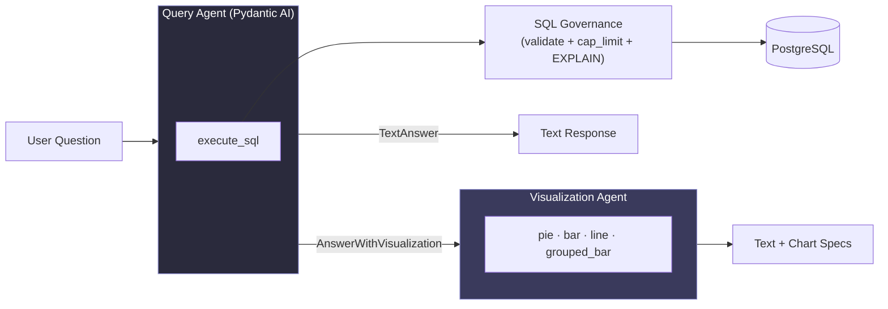
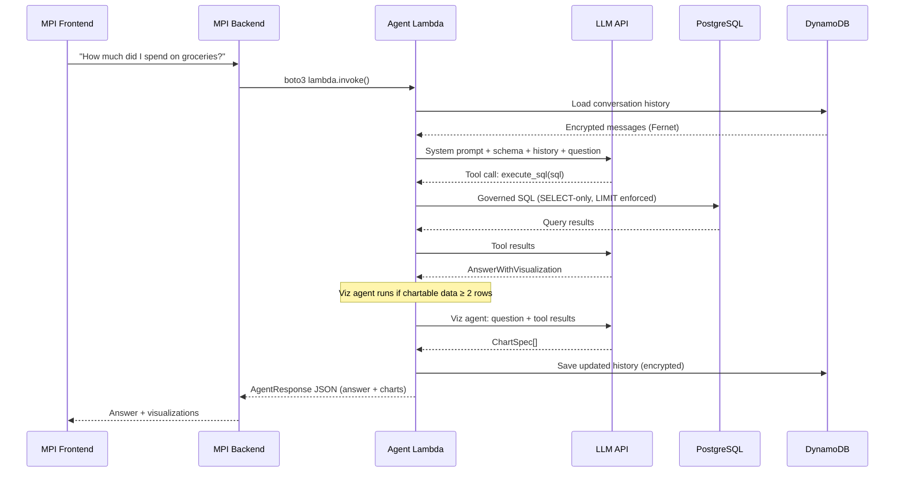
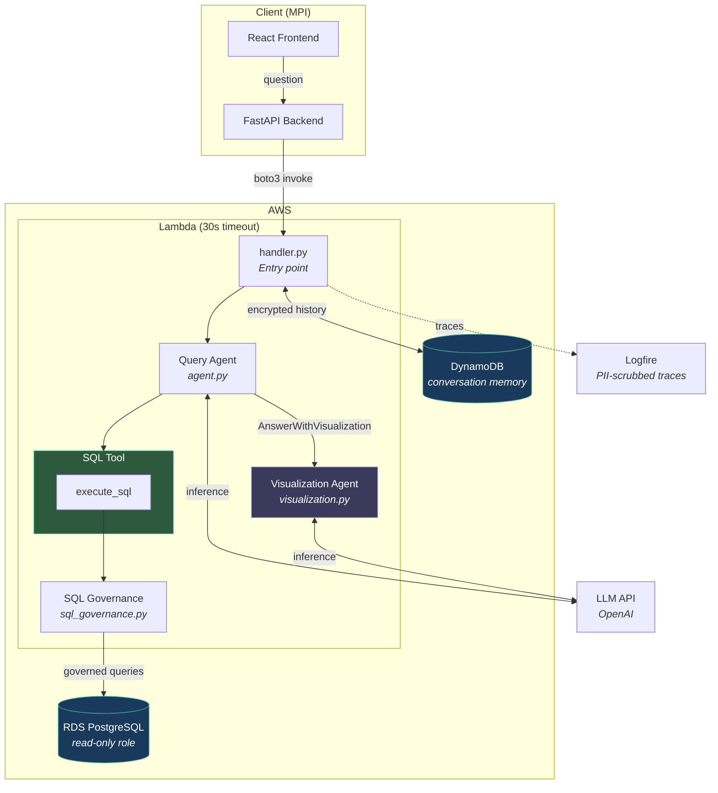
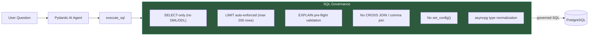
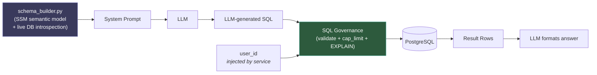
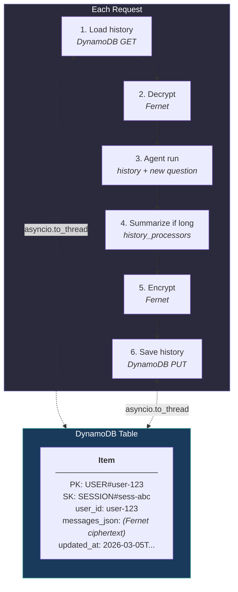
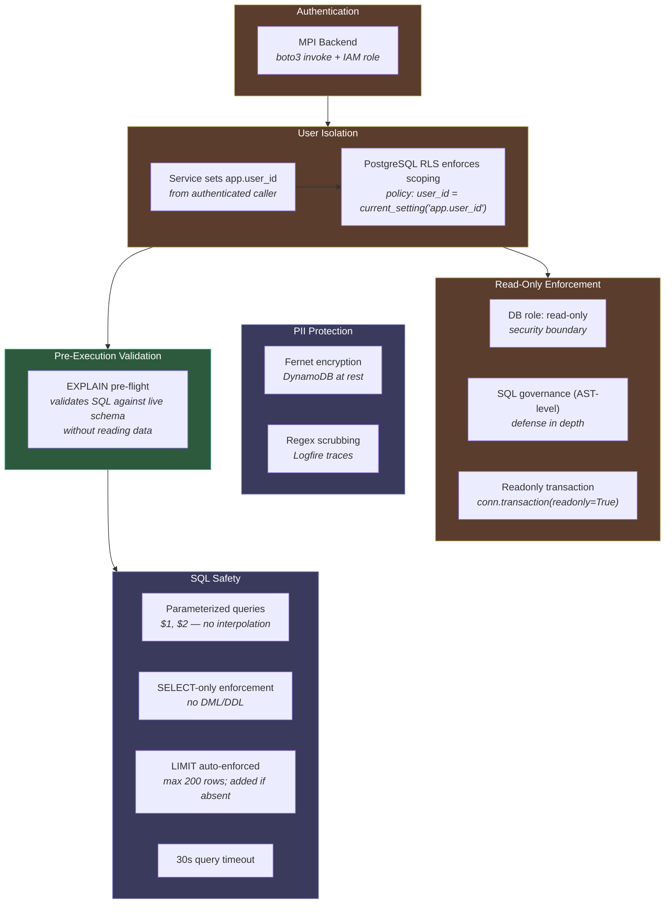

# finance-query-agent

AI-powered financial query agent. Answers natural language questions about spending, income, and transactions. Deployed as an AWS Lambda invoked by MPI's backend via `boto3 lambda.invoke()`.

Uses a **text-to-SQL** architecture: the LLM writes SQL against a documented schema; a governance layer validates every query before execution. A secondary **visualization agent** generates chart specs from query results when the data is chartable.


```mermaid
graph LR
    Q["User Question"] --> QUERY_AGENT

    subgraph QUERY_AGENT["Query Agent (Pydantic AI)"]
        direction TB
        T1["execute_sql"]
    end

    QUERY_AGENT -->|"TextAnswer"| OUT_TEXT["Text Response"]
    QUERY_AGENT -->|"AnswerWithVisualization"| VIZ_AGENT

    subgraph VIZ_AGENT["Visualization Agent"]
        VIZ_OUT["pie · bar · line · grouped_bar"]
    end

    VIZ_AGENT --> OUT_VIZ["Text + Chart Specs"]

    T1 --> GOV["SQL Governance<br/>(validate + cap_limit + EXPLAIN)"]
    GOV --> PG[("PostgreSQL")]

    style QUERY_AGENT fill:#2a2a3c,stroke:#88c,color:#fff
    style VIZ_AGENT fill:#3a3a5c,stroke:#88c,color:#fff
```

## Request Lifecycle


```mermaid
sequenceDiagram
    participant Client as MPI Frontend
    participant Backend as MPI Backend
    participant Lambda as Agent Lambda
    participant LLM as LLM API
    participant PG as PostgreSQL
    participant Dynamo as DynamoDB

    Client->>Backend: "How much did I spend on groceries?"
    Backend->>Lambda: boto3 lambda.invoke()

    Lambda->>Dynamo: Load conversation history
    Dynamo-->>Lambda: Encrypted messages (Fernet)

    Lambda->>LLM: System prompt + schema + history + question
    LLM-->>Lambda: Tool call: execute_sql(sql)

    Lambda->>PG: Governed SQL (SELECT-only, LIMIT enforced)
    PG-->>Lambda: Query results

    Lambda->>LLM: Tool results
    LLM-->>Lambda: AnswerWithVisualization

    Note over Lambda: Viz agent runs if chartable data ≥ 2 rows
    Lambda->>LLM: Viz agent: question + tool results
    LLM-->>Lambda: ChartSpec[]

    Lambda->>Dynamo: Save updated history (encrypted)
    Lambda-->>Backend: AgentResponse JSON (answer + charts)
    Backend-->>Client: Answer + visualizations
```

## Architecture


```mermaid
graph TB
    subgraph Client["Client (MPI)"]
        FE[React Frontend]
        BE[FastAPI Backend]
    end

    FE -->|question| BE
    BE -->|boto3 invoke| HANDLER

    subgraph AWS["AWS"]
        subgraph Lambda["Lambda (30s timeout)"]
            HANDLER[handler.py<br/><i>Entry point</i>]
            HANDLER --> AGENT
            AGENT[Query Agent<br/><i>agent.py</i>]
            AGENT --> TOOLS

            subgraph TOOLS["SQL Tool"]
                T1[execute_sql]
            end

            GOV[SQL Governance<br/><i>sql_governance.py</i>]
            T1 --> GOV

            AGENT -->|AnswerWithVisualization| VIZ
            VIZ[Visualization Agent<br/><i>visualization.py</i>]
        end

        RDS[(RDS PostgreSQL<br/><i>read-only role</i>)]
        DDB[(DynamoDB<br/><i>conversation memory</i>)]
    end

    LLM_API[LLM API<br/><i>OpenAI</i>]
    LOGFIRE[Logfire<br/><i>PII-scrubbed traces</i>]

    GOV -->|governed queries| RDS
    HANDLER <-->|encrypted history| DDB
    AGENT <-->|inference| LLM_API
    VIZ <-->|inference| LLM_API
    HANDLER -.->|traces| LOGFIRE

    style TOOLS fill:#2d5a3d,stroke:#4a9,color:#fff
    style VIZ fill:#3a3a5c,stroke:#88c,color:#fff
    style RDS fill:#1a3a5c,stroke:#4a9,color:#fff
    style DDB fill:#1a3a5c,stroke:#4a9,color:#fff
```

## Tool Architecture

The agent has one tool: `execute_sql`. The LLM writes a SELECT query against the schema injected into the system prompt; governance validates it before execution.


```mermaid
graph LR
    Q[User Question] --> AGENT[Pydantic AI Agent]

    AGENT --> T1[execute_sql]

    T1 --> GOV

    subgraph GOV["SQL Governance"]
        direction TB
        R1["SELECT-only (no DML/DDL)"]
        R2["LIMIT auto-enforced (max 200 rows)"]
        R3["EXPLAIN pre-flight validation"]
        R4["No CROSS JOIN / comma join"]
        R5["No set_config()"]
        R6["asyncpg type normalization"]
    end

    GOV -->|"governed SQL"| DB[(PostgreSQL)]

    style GOV fill:#2d5a3d,stroke:#4a9,color:#fff
```

## Query Generation Pipeline

The LLM generates SQL against a documented schema. The schema context is built at cold start by `schema_builder.py` — fetching the semantic model from SSM and merging it with live DB introspection — then injected into the system prompt on every request. The governance layer (`validate_select_only` + `cap_limit`) validates the LLM-generated SQL before execution: enforcing SELECT-only, auto-capping LIMIT to 200 rows, blocking dangerous patterns (CROSS JOIN, `set_config()`). An `EXPLAIN` pre-flight then validates the query against the live schema in a readonly transaction before any data is read. User scoping is enforced by PostgreSQL RLS via `app.user_id` session variable set by the service.


```mermaid
graph LR
    SY["schema_builder.py<br/>(SSM semantic model<br/>+ live DB introspection)"] --> SP[System Prompt]
    SP --> LLM[LLM]
    LLM --> SQL["LLM-generated SQL"]

    SQL --> GOV["SQL Governance<br/>(validate + cap_limit + EXPLAIN)"]
    UID["user_id<br/><i>injected by service</i>"] --> GOV

    GOV --> PG[(PostgreSQL)]
    PG --> ROWS[Result Rows]
    ROWS --> LLM2[LLM formats answer]

    style SY fill:#3a3a5c,stroke:#88c,color:#fff
    style GOV fill:#2d5a3d,stroke:#4a9,color:#fff
```

## Conversation Memory


```mermaid
graph TB
    subgraph Request["Each Request"]
        LOAD["1. Load history<br/><i>DynamoDB GET</i>"]
        DECRYPT["2. Decrypt<br/><i>Fernet</i>"]
        RUN["3. Agent run<br/><i>history + new question</i>"]
        SUMMARIZE["4. Summarize if long<br/><i>history_processors</i>"]
        ENCRYPT["5. Encrypt<br/><i>Fernet</i>"]
        SAVE["6. Save history<br/><i>DynamoDB PUT</i>"]

        LOAD --> DECRYPT --> RUN --> SUMMARIZE --> ENCRYPT --> SAVE
    end

    subgraph DynamoDB["DynamoDB Table"]
        direction TB
        ITEM["<b>Item</b><br/>──────────────────<br/>PK: USER#user-123<br/>SK: SESSION#sess-abc<br/>user_id: user-123<br/>messages_json: <i>(Fernet ciphertext)</i><br/>updated_at: 2026-03-05T..."]
    end

    LOAD <-.->|"asyncio.to_thread"| DynamoDB
    SAVE <-.->|"asyncio.to_thread"| DynamoDB

    style DynamoDB fill:#1a3a5c,stroke:#4a9,color:#fff
    style Request fill:#2a2a3c,stroke:#88c,color:#fff
```

## Security Model


```mermaid
graph TB
    subgraph AUTH["Authentication"]
        IAM["MPI Backend<br/><i>boto3 invoke + IAM role</i>"]
    end

    subgraph ISOLATION["User Isolation"]
        INJ["Service sets app.user_id<br/><i>from authenticated caller</i>"]
        RLS["PostgreSQL RLS enforces scoping<br/><i>policy: user_id = current_setting('app.user_id')</i>"]
        INJ --> RLS
    end

    subgraph READONLY["Read-Only Enforcement"]
        ROLE["DB role: read-only<br/><i>security boundary</i>"]
        GOV["SQL governance (AST-level)<br/><i>defense in depth</i>"]
        TXN["Readonly transaction<br/><i>conn.transaction(readonly=True)</i>"]
    end

    subgraph PREFLIGHT["Pre-Execution Validation"]
        EXPLAIN["EXPLAIN pre-flight<br/><i>validates SQL against live schema<br/>without reading data</i>"]
    end

    subgraph PII["PII Protection"]
        FERNET["Fernet encryption<br/><i>DynamoDB at rest</i>"]
        REGEX["Regex scrubbing<br/><i>Logfire traces</i>"]
    end

    subgraph SQLS["SQL Safety"]
        PARAM["Parameterized queries<br/><i>$1, $2 — no interpolation</i>"]
        SELONLY["SELECT-only enforcement<br/><i>no DML/DDL</i>"]
        LIMIT["LIMIT auto-enforced<br/><i>max 200 rows; added if absent</i>"]
        TIMEOUT["30s query timeout"]
    end

    AUTH --> ISOLATION
    ISOLATION --> READONLY
    ISOLATION --> PREFLIGHT
    PREFLIGHT --> SQLS
    PII ~~~ SQLS

    style AUTH fill:#5a3d2d,stroke:#a94,color:#fff
    style ISOLATION fill:#5a3d2d,stroke:#a94,color:#fff
    style READONLY fill:#5a3d2d,stroke:#a94,color:#fff
    style PREFLIGHT fill:#2d5a3d,stroke:#4a9,color:#fff
    style PII fill:#3a3a5c,stroke:#88c,color:#fff
    style SQLS fill:#3a3a5c,stroke:#88c,color:#fff
```

## Schema Configuration

`schema_builder.py` builds the schema context injected into the system prompt on every invocation. At cold start it fetches the semantic model (tables, columns, business rules, example queries) from SSM Parameter Store, then merges it with live DB introspection. The result is cached for the lifetime of the Lambda instance. No client-side configuration is required.

## Invocation

POST request with JSON body:

```json
{
  "user_id": "user-123",
  "session_id": "sess-abc",
  "question": "How much did I spend on groceries last month?"
}
```

Response:

```json
{
  "answer": "You spent $235.50 on groceries last month across 3 transactions.",
  "tool_calls": [...],
  "visualizations": [
    {
      "chart_type": "pie",
      "title": "Spending by Category (USD)",
      "currency": "USD",
      "slices": [{"label": "Groceries", "value": 235.50, "percentage": 42.1}, ...]
    }
  ],
  "unresolved": false,
  "original_question": "How much did I spend on groceries last month?",
  "token_usage": { "input_tokens": 1200, "output_tokens": 85 }
}
```

`visualizations` is `null` when the query agent returns `TextAnswer` or the data isn't chartable. Chart types: `pie`, `bar`, `line`, `grouped_bar`.

## Project Structure

```
src/finance_query_agent/
├── handler.py              Lambda entry point
├── agent.py                Query agent + system prompt
├── visualization.py        Visualization agent (chart spec generation)
├── config.py               Settings from env vars
├── sql_governance.py       SQL validation (SELECT-only, LIMIT cap, CROSS JOIN / set_config blocking)
├── schema_builder.py       Schema context builder (SSM semantic model + live DB introspection)
├── connection.py           asyncpg pool, warm-cached across Lambda invocations
├── memory.py               DynamoDB conversation history
├── encryption.py           Fernet field encryption
├── redaction.py            Regex PII scrubbing
├── history.py              Conversation summarization
├── observability.py        Logfire + scrubbing callback
├── exceptions.py           Exception hierarchy
├── tools/
│   └── sql.py              execute_sql tool + asyncpg type normalization
└── schemas/
    ├── charts.py           Chart specs (pie, bar, line, grouped_bar)
    └── responses.py        AgentResponse, AgentOutput, ChartSpec
```

## Development

```bash
uv sync --all-extras              # Install all deps (including dev)
uv run pytest                     # Run all tests
uv run pytest -x                  # Stop on first failure
uv run ruff check . --fix         # Lint + auto-fix
uv run ruff format .              # Format
uv run mypy src/                  # Type check
```

## Deployment

See `docs/deployment.md` and `terraform/` for infrastructure setup.

## License

MIT
