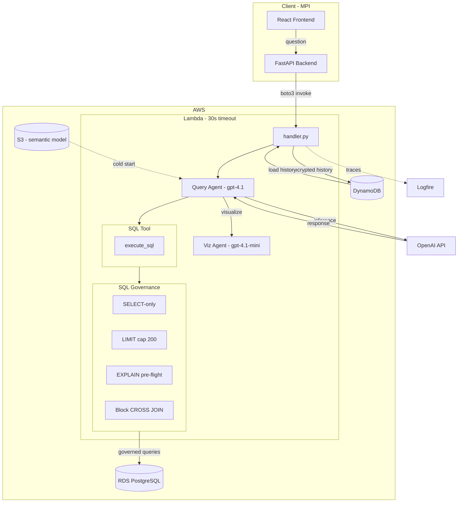
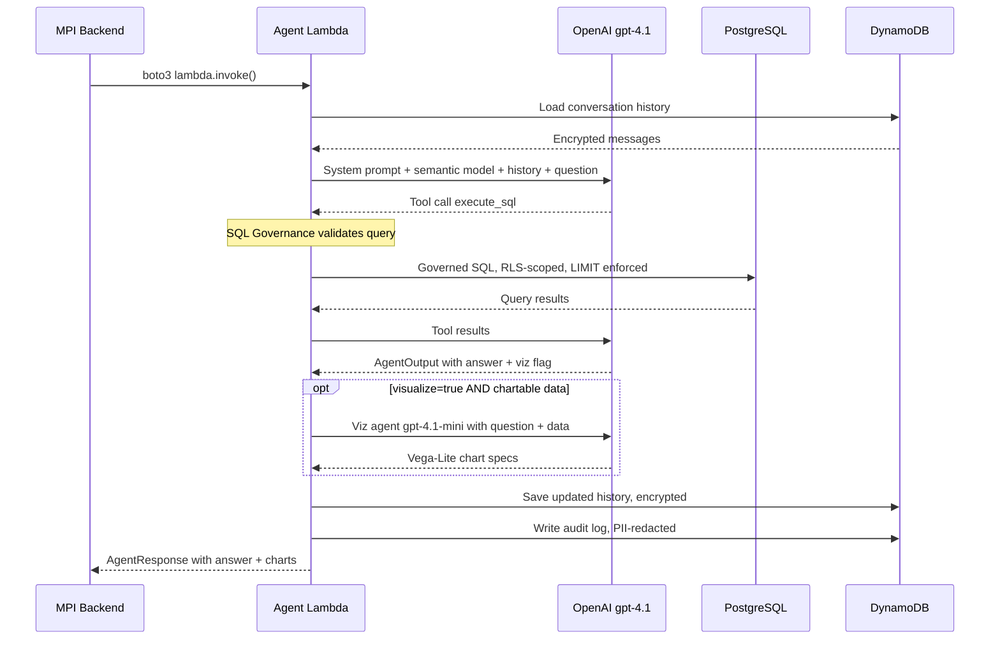

# finance-query-agent

AI-powered financial query agent. Answers natural language questions about spending, income, and transactions. Deployed as an AWS Lambda invoked by MPI's backend via `boto3 lambda.invoke()`.

Uses a **text-to-SQL** architecture: the LLM writes SQL against a semantic model; a governance layer validates every query before execution. A secondary visualization agent generates Vega-Lite chart specs when the data is chartable.

## Architecture


```mermaid
graph TB
    subgraph Client["Client - MPI"]
        FE[React Frontend]
        BE[FastAPI Backend]
    end

    FE -->|question| BE
    BE -->|boto3 invoke| HANDLER

    subgraph AWS
        subgraph Lambda["Lambda - 30s timeout"]
            HANDLER[handler.py]
            HANDLER --> AGENT
            AGENT["Query Agent - gpt-4.1"]
            AGENT --> SQL_TOOL

            subgraph SQL_TOOL["SQL Tool"]
                T1[execute_sql]
            end

            subgraph GOV["SQL Governance"]
                R1["SELECT-only"]
                R2["LIMIT cap 200"]
                R3["EXPLAIN pre-flight"]
                R4["Block CROSS JOIN"]
            end

            SQL_TOOL --> GOV

            AGENT -->|visualize| VIZ
            VIZ["Viz Agent - gpt-4.1-mini"]
        end

        S3[("S3 - semantic model")]
        RDS[("RDS PostgreSQL")]
        DDB[("DynamoDB")]
    end

    LOGFIRE["Logfire"]

    S3 -.->|cold start| AGENT
    GOV -->|governed queries| RDS
    HANDLER -->|encrypted history| DDB
    DDB -->|load history| HANDLER
    AGENT -->|inference| LLM_API["OpenAI API"]
    LLM_API -->|response| AGENT
    HANDLER -.->|traces| LOGFIRE
```

## Request Lifecycle


```mermaid
sequenceDiagram
    participant Client as MPI Backend
    participant Lambda as Agent Lambda
    participant LLM as OpenAI gpt-4.1
    participant PG as PostgreSQL
    participant Dynamo as DynamoDB

    Client->>Lambda: boto3 lambda.invoke()

    Lambda->>Dynamo: Load conversation history
    Dynamo-->>Lambda: Encrypted messages

    Lambda->>LLM: System prompt + semantic model + history + question
    LLM-->>Lambda: Tool call execute_sql

    Note over Lambda: SQL Governance validates query
    Lambda->>PG: Governed SQL, RLS-scoped, LIMIT enforced
    PG-->>Lambda: Query results

    Lambda->>LLM: Tool results
    LLM-->>Lambda: AgentOutput with answer + viz flag

    opt visualize=true AND chartable data
        Lambda->>LLM: Viz agent gpt-4.1-mini with question + data
        LLM-->>Lambda: Vega-Lite chart specs
    end

    Lambda->>Dynamo: Save updated history, encrypted
    Lambda->>Dynamo: Write audit log, PII-redacted
    Lambda-->>Client: AgentResponse with answer + charts
```

## Semantic Model

The schema context injected into the system prompt is built from a **semantic model** — a YAML file describing tables, columns, relationships, metrics, filters, and verified queries. Fetched from S3 at cold start and cached for the Lambda instance lifetime. No DB introspection.

The semantic model defines:
- **Tables & columns** with types, descriptions, synonyms, and enum values
- **Relationships** (JOIN definitions between tables)
- **Metrics** (pre-defined aggregations like `SUM(amount) WHERE movement_direction = 'DEBIT'`)
- **Verified queries** (example question-SQL pairs for few-shot guidance)
- **Business rules** (custom instructions for edge cases)

For local development, set `SEMANTIC_MODEL_LOCAL_PATH` to use a local YAML file instead of S3.

## Security

| Layer | Mechanism |
|-------|-----------|
| **User isolation** | PostgreSQL RLS via `app.user_id` session variable, set by the service (never by the LLM) |
| **Read-only** | DB role with SELECT-only grants + `conn.transaction(readonly=True)` |
| **SQL governance** | SELECT-only enforcement, LIMIT cap (200), CROSS JOIN / `set_config()` blocking |
| **Pre-flight** | `EXPLAIN` validates SQL against live schema without reading data |
| **PII at rest** | Fernet encryption for DynamoDB conversation history |
| **PII in traces** | Regex scrubbing in Logfire spans and audit logs |
| **Prompt hardening** | System prompt rejects override attempts, refuses non-financial questions |

## Invocation

```json
{
  "user_id": 1,
  "session_id": "sess-abc",
  "question": "How much did I spend on groceries last month?"
}
```

`user_id` must be a positive integer (int or numeric string). `session_id` is a free-form string for conversation continuity.

Response:

```json
{
  "answer": "You spent $235.50 on groceries last month across 3 transactions.",
  "tool_calls": [
    {
      "tool_name": "execute_sql",
      "parameters": { "sql": "..." },
      "execution_time_ms": 42,
      "row_count": 3
    }
  ],
  "visualizations": [
    {
      "spec": {
        "$schema": "https://vega.github.io/schema/vega-lite/v5.json",
        "mark": "arc",
        "title": "Grocery Spending",
        "data": { "values": ["..."] },
        "encoding": { "...": "..." }
      }
    }
  ],
  "unresolved": false,
  "original_question": "How much did I spend on groceries last month?",
  "token_usage": { "input_tokens": 1200, "output_tokens": 85 }
}
```

`visualizations` is `null` when `visualize=false` or the data isn't chartable (< 2 rows). Chart types: `bar`, `line`, `pie`, `area`, `scatter`, `heatmap`, `stacked_bar`, `grouped_bar`.

## Project Structure

```
src/finance_query_agent/
├── handler.py              Lambda entry point
├── agent.py                Query agent (gpt-4.1) + system prompt
├── visualization.py        Visualization agent (gpt-4.1-mini, Vega-Lite)
├── vega_builder.py         ChartIntent → Vega-Lite v5 spec
├── config.py               Settings from env vars (pydantic-settings)
├── schema_builder.py       Semantic model (S3 YAML → system prompt context)
├── sql_governance.py       SQL validation (SELECT-only, LIMIT, EXPLAIN)
├── connection.py           asyncpg pool, warm-cached across invocations
├── memory.py               DynamoDB conversation history (Fernet-encrypted)
├── audit.py                DynamoDB audit trail (PII-redacted, 90-day TTL)
├── history.py              Conversation summarization (gpt-4.1-mini)
├── encryption.py           Fernet field encryption
├── redaction.py            Regex PII scrubbing
├── observability.py        Logfire initialization + scrubbing callback
├── exceptions.py           Exception hierarchy
├── tools/
│   └── sql.py              execute_sql tool + asyncpg type normalization
└── schemas/
    ├── charts.py           ChartIntent + VegaLiteChart models
    └── responses.py        AgentOutput, AgentResponse, ToolCallRecord, TokenUsage
```

## Development

```bash
uv sync --all-extras              # Install all deps (including dev)
uv run pytest                     # Run all tests
uv run pytest -x                  # Stop on first failure
uv run ruff check . --fix         # Lint + auto-fix
uv run ruff format .              # Format
uv run mypy src/                  # Type check
```

## Deployment

See `docs/deployment.md` and `terraform/` for infrastructure setup.

## License

MIT
